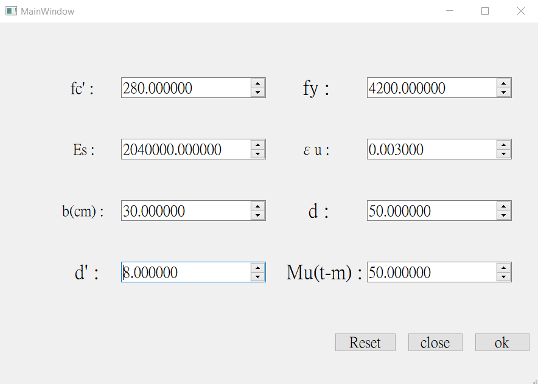

簡介

這是一個計算使用者設計一個混凝土梁所需的鋼筋含量的程式，並且還會一並檢查是否符合台灣的設計規範。

**所需第三方模組**

本程式需要以下第三方模組：

1.  NumPy

2.  Pyqt5

3.  Math

如何使用
--------

將程式自 GitHub clone (Download)下來，即可以執行

### 啟動指令

Python main.py

### GUI介面

此為啟動程式後會看到的GUI介面，只要在裡面輸入相關數據即可進行鋼筋含量之計算
